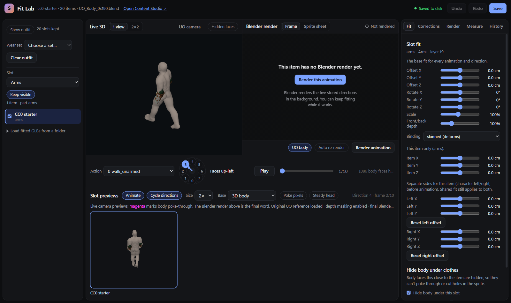
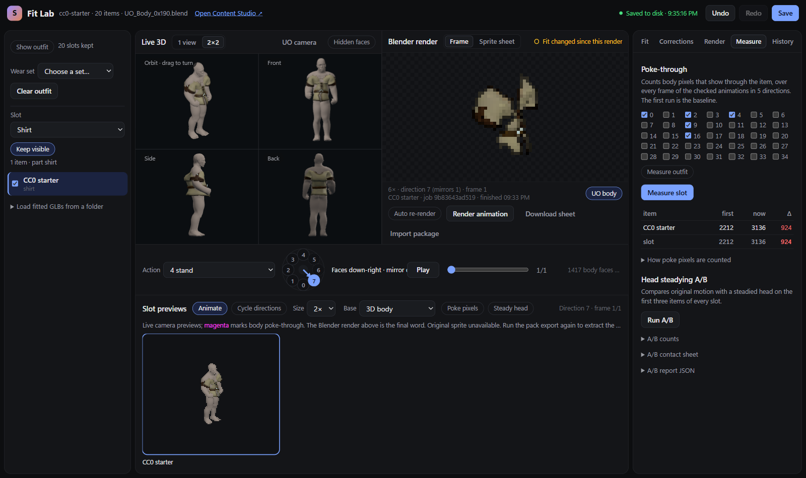
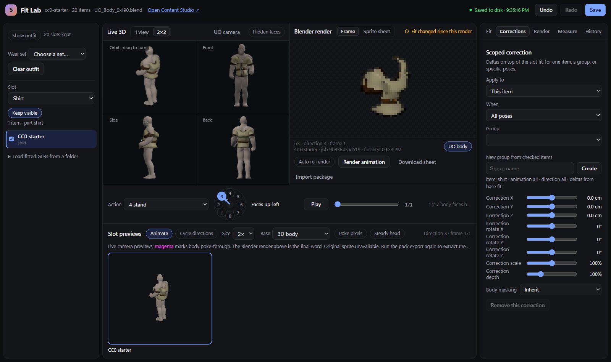
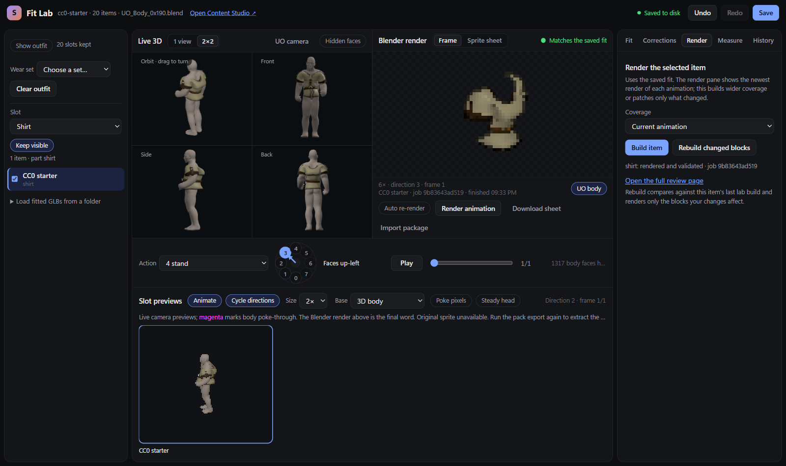
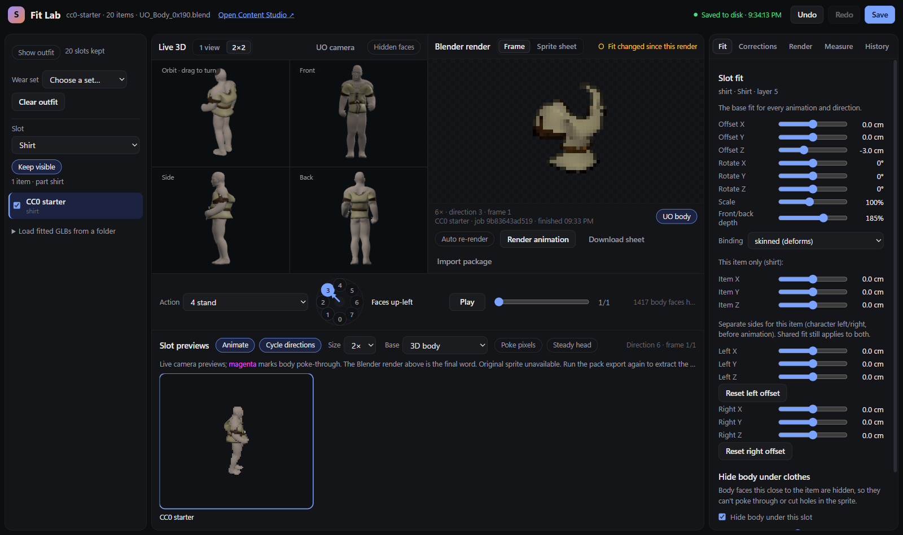

# Fit Lab workflow: fitting one slot

Fit one equipment slot from start to finish: pick the slot, set the Slot fit, switch on Hide body, Measure, add
Corrections, check the facing ring and the 2x2 view, Render, and read the Matches status. The example is the bundled
CC0 `shirt` (layer 5).

Everything below was run on a clean worktree (Windows, Blender 4.2.0, `workspace\venv` from
`launchers\dev\worktree-venv.bat`, lab served on port 8791 so it does not clash with a lab already open on 8774).
Numbers are from that run; yours differ with the body and the fit.

Previous guide: [Blender render, end to end](blender-render-end-to-end.md). Reference for every control:
[Fit Lab README](../../tools/fit-lab/README.md).

## 0. Start the lab

```powershell
workspace\venv\Scripts\python.exe tools/uo-content/pipeline.py setup --source third_party/UO_Model3D_v13
workspace\venv\Scripts\python.exe tools/starter-assets/run.py --prepare-lab
workspace\venv\Scripts\python.exe tools/fit-lab/run.py serve --pack cc0-starter --port 8791 --no-browser
```

- `setup` installs the body (step 1 of the render guide); the lab and its Render button need it.
- `--prepare-lab` runs headless Blender once and writes the lab data for this checkout into
  `workspace/ultima-online/fit-lab/cc0-starter/` (20 items, `body.glb`, `items/*.glb`, `lab-items.json`). It took 9 s.
  Redo it after a body or mapping change. Do not copy this folder from another checkout:
  `lab-items.json` records the absolute path of the mapping it was made from, so a copy keeps building with the other
  checkout's mapping (a copy from before the 54-bone body failed with `KeyError: ... "toe.L" not found`).
- `serve` prints `Fit lab: http://127.0.0.1:8791/`. Without `--port` it uses 8774, and `launchers\editor\fit-lab.bat
  cc0-starter` does the same through the shared launcher.
- The cc0 pack saves its fits in the checkout (`workspace/.../cc0-starter/lab-adjustments.json`); licensed packs save
  in the sidecar.
- The only console message on load is a 404 for `favicon.ico`.
- Stop the server when you are done (Ctrl+C in its window; it runs in the foreground).

The page opens like this: slot list on the left, the live 3D body and the Blender render pane in the middle, the
facing ring, action and frame below them, slot previews under that, and the tabs (Fit, Corrections, Render, Measure,
History) on the right.



## 1. Pick the slot, action and item

1. **Slot** (left): choose `Shirt`. The item list shows `CC0 starter`; tick the item to show it in 3D, click it to
   select it. The sliders, Measure and Render all act on the *selected* item.
2. **Action** (centre): choose `4 stand`. The 5 stored facings of this action are what Measure and Render cover.
3. **Base** (slot previews): `Original UO sprite` needs the extracted client reference (`reference.png`), which only a
   client export produces; a fresh `--prepare-lab` has none and the pane says *Original sprite unavailable*. Use
   `3D body` (the CC0 flow needs no client data) or `Item only`.

## 2. Slot fit

Fit tab, **Slot fit**: offset X/Y/Z (cm), rotate X/Y/Z, uniform scale, front/back depth, and binding (`skinned`
deforms with the body, `rigid` follows one bone). It is the base fit for every animation and direction of the slot.
Changes autosave after 800 ms ("Saved to disk" top right); Ctrl+Z undoes.

The shirt starts with front/back depth 185 % from its mapping. To try an edit, drag Offset Z to -3 cm: the 3D view
and the previews move at once.

*This item only* offsets and the Left/Right offsets are for one item (and, for gloves and boots, one side of the
character); leave them at 0 unless one item in the slot is off.

## 3. Hide body under clothes

Same tab, below the offsets. **Hide body under this slot** (on by default for the CC0 set) removes body faces within
*outward* of the item and, with the inward distance, those just inside it, so the body cannot poke through the cloth
or cut holes in the sprite. The 3D view shows the removed faces with **Hidden faces**. The saved default for the
shirt is outward 2 cm, inward 1 cm. The rule is the one the Blender build uses, so what you see is what renders
(`pack_fit.hide_body_under`).

## 4. Measure

Measure tab: tick the actions to count (default: 0, 2, 4, 9, 16), press **Measure slot**. It counts body pixels
showing through the item over every frame of the checked actions in the 5 stored directions (175 poses took about 20 s
here). The first run is the baseline; each later run shows `now` and `Δ`.

Worked numbers on the shirt, action 4 only plus the defaults, Offset Z at -3 cm, 175 poses:

| Hide body | poke pixels | Δ vs first run |
|---|---|---|
| on | 2212 | baseline |
| off | 3136 | +924 |

So Hide body removes about 30 % of the poke-through at this fit. Lower is better, but a lower count alone does not
prove a better match to the original artwork; look at the previews too. The first run after a reload is the new
baseline (it is kept only in the open page), and counts follow the item's occlusion mode, so compare runs, not
absolutes ("How poke pixels are counted" in the tab explains the rule).



## 5. Corrections for one pose or one item

The slot fit is the base for all poses. When one pose or one item is off, add a **Scoped correction** (Corrections
tab) rather than moving the base:

- **Apply to**: this item, this slot, a named group (create one from the ticked items with *New group from checked
  items*) or the entire pack.
- **When**: all poses, this animation, this direction or this animation and direction.
- Correction X/Y/Z, rotate, scale and depth are deltas added to the base. Choosing a pose scope pauses playback.
- **Body masking** overrides the occlusion mode for that scope (`Inherit`, `Clothing: limbs/head`,
  `Attachment: whole body`, `No body masking`); see the masking guide.
- **Remove this correction** deletes it. Directions 5-7 share the corrections of 3-1.



## 6. Facing ring and the 2x2 view

- **Facing ring**: each number sits where the character faces on screen. Read back from the lab for the shirt:
  0 faces down (toward the viewer), 1 down-left, 2 left, 3 up-left, 4 up (away), and 5 up-right, 6 right,
  7 down-right, which the lab labels *mirror of 3 / 2 / 1* (dashed on the ring). Arrow keys turn one step.
  Only 0-4 are rendered; 5-7 are the client's mirror of 3-1, so fit and judge 0-4 and expect 5-7 to follow.
- **1 view / 2x2** (top of the 3D pane, remembered per browser): orbit view plus fixed front, side and back views that
  turn with the character. Use front and back for torso width and depth, side for depth and sleeve position, and
  step through the ring so each stored facing is checked once. The screenshot above is the 2x2 view with the ring in
  the middle.
- Slot previews (bottom): every item of the slot at 2x-4x with their own animation; **Cycle directions** advances every
  two seconds, **Poke pixels** paints body pixels poking through in magenta. These are live camera renders, not the
  final Blender output.
- **Keep visible** / **Show outfit** keep other slots on screen while you fit this one (they follow the saved fit;
  only the edited slot hides body faces and is measured unless *Measure outfit* is on).

## 7. Render and Matches

Render tab (or **Render this animation** / **Render animation** over the Blender pane): the real renderer, run in
the background on a snapshot of the saved fit. Coverage `Current animation` is the right size for iterating (
one action in 5 directions took under 30 s here); `Preview: 5 animations` and `All 35 animations` are
wider. **Rebuild changed blocks** re-renders only the blocks your edits affect. The pane then shows the newest finished
render for the animation, locked to the frame and facing, with **Sprite sheet**, **Download sheet** and **Import
package** (the VD package of the job).

The status in the pane's corner tells you whether you can trust it:

| Status | Meaning |
|---|---|
| *Matches the saved fit* (green) | the render was built from exactly the fit now saved |
| *Fit changed since this render* (amber) | you edited after rendering; render again before judging |



After Offset Z was changed to -3 cm the status turned amber:



**Auto re-render** does the render for you once the saved fit has been still for 3 s. A render only appears after
"Saved to disk"; if the build says *Wait for Saved to disk before rendering*, wait for the status or press Save.

## 8. Finish

1. Re-measure and compare with the baseline; render once more so the status is green.
2. Press **Save**. The fits are in `lab-adjustments.json` (the last three saves are in `lab-adjustments-backups/`;
   Restore backup is an undoable edit).
3. Bring the fits into builds: [Blender render, end to end](blender-render-end-to-end.md), step "Fit Lab
   adjustments".
4. If the page says *Disk changed since this browser session*, the file on disk and this browser's recovered edits
   differ (this happens after regenerating lab data under an open tab): choose **Use the saved file** to keep what
   is on disk or **Keep my recovered edits** to replace it; nothing is overwritten until you choose.

Troubleshooting for stale lab data, 409 save conflicts and render failures belongs in the troubleshooting guide; the
two failures met while writing this one are above (copied lab data pointing at an old mapping, step 0; recovery
choice, step 8).

## What was verified, and what was not

- Run for this guide: steps 0-8 on the CC0 shirt in a headless Chrome session, the build finished and validated
  (job `9b83643ad519`, status *Matches the saved fit*), Measure on and off, the ring labels for 0-7.
- Not run: a licensed pack (needs the sidecar), the `Original UO sprite` base (needs a client export), scoped
  corrections beyond opening the tab, Rebuild changed blocks, wider coverage.
