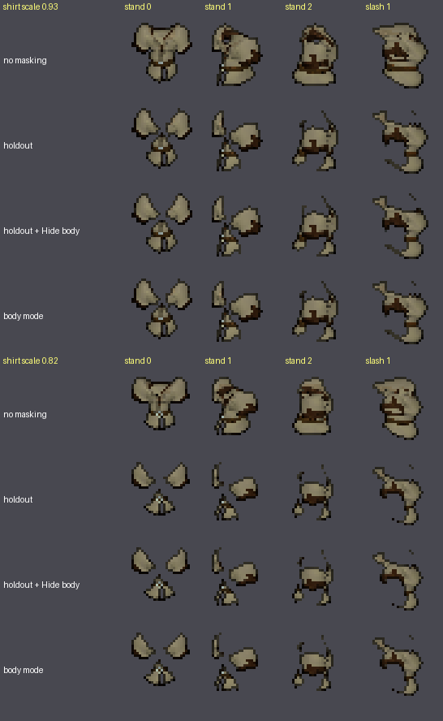

# Masking cleanup: body holdout, occlusion modes and Hide body

When an item sprite has holes, a missing chunk or a pale edge where the body "shows through", the cause is the body
holdout. This guide explains what the holdout does, what the three occlusion modes change, what Hide body (outward and
inward) changes, and how to tell whether a fault belongs to the body or to the item. The example is the bundled CC0
`shirt`, deliberately fitted too small so the body is in front of it.

Previous guide: [Fit Lab workflow](fit-lab-workflow.md). Reference: [body occlusion](../body-occlusion.md),
[Fit Lab README](../../tools/fit-lab/README.md) ("Scoped corrections and masking", "How poke pixels are counted").

Everything below was run on a clean worktree (Windows, Blender 4.2.0, `workspace\venv` from
`launchers\dev\worktree-venv.bat`, body installed with `pipeline.py setup`, see step 1 of
[Blender render, end to end](blender-render-end-to-end.md)). No UO client data is involved.

## 1. What the holdout is

An item render contains only the item. The complete posed body is in the scene as an invisible depth proxy
(`SpriteMotion_DepthBody`, never drawn in colour). For every pixel the renderer compares the nearest body depth with the
nearest item depth. Where the body is closer than the item by more than the **holdout margin** (1 cm), the item pixel is
removed. The body is therefore a *holdout*: it never appears in the sprite, but it cuts the item.

Consequences you will recognise:

- A sleeve behind the torso, or the far arm's bracer, disappears. That is correct.
- A shirt that is too small or too far back loses the parts the body covers. That is a fit fault, not a masking fault.
- Body pixels "poking through" in the lab (magenta in **Poke pixels**) are the pixels the holdout will cut.

Final holdout always uses the **complete** body, even where Hide body removed faces from the fitting body.

## 2. The three occlusion modes

Set per part in the mapping (`occlusion`), per scope in a Fit Lab correction (**Body masking**: `Inherit`,
`Clothing: limbs/head`, `Attachment: whole body`, `No body masking`), or per job in the settings (`"occlusion"`).

| Mode | Settings value | What it does |
|---|---|---|
| Clothing | `clothing` (default) | Full-body holdout, plus a bounded contact allowance: where the nearest body and item surfaces belong to the same anatomical region (left and right kept apart), the margin grows to the Hide body inward distance. |
| Body | `body` (default for back/quiver) | Full-body holdout with no allowance. |
| None | `none` | The renderer skips the holdout. The item is drawn whole, even where the body is in front of it. |

The allowance is finite (`tools/uo-content/occlusion.py`, `blocked_pixels`): a far-side surface of the same limb is
still cut once it exceeds it.

## 3. Hide body, outward and inward

**Hide body under this slot** (Fit tab; `hide_body` in a mapping: `enabled`, `outward`, `inward`, all three required in
a saved fit) removes body faces from the *fitting* body: those within `outward` of the item's outside and, with
`inward`, those just inside it. It applies to `clothing` items only. It does two things:

1. The fitting body no longer drives skin push-out or collision with the removed faces, so the item is not shoved away
   from, or snagged on, skin that is underneath it anyway. In the 3D view the removed faces show as **Hidden faces**.
2. `inward` is also the contact allowance of the holdout in step 2.

It never removes faces from the holdout. The bundled shirt uses outward 2 cm, inward 1 cm. Larger numbers hide more
skin but also skin that should stay visible at the neck and wrists; raise them in small steps and re-measure.

## 4. Reproduce the before/after

Install the body once (`pipeline.py setup`), then build the same item four times with only the masking changed. The
fit is deliberately undersized (`scale` 0.93 and 0.82) so the holdout has something to cut. The settings come from
`starters.settings()` plus overrides:

```powershell
workspace\venv\Scripts\python.exe -c "import json,sys; sys.path.insert(0,'tools/uo-content'); import starters; s,_=starters.settings('shirt',{}); s.update(occlusion='clothing', hide_body={'enabled':True,'outward':0.02,'inward':0.01}, actions=[4,9], blocks=[[4,0],[4,1],[4,2],[9,1]]); s['fit_adjustments']={'parts':{'shirt':{'scale':0.93,'hide_body':{'enabled':False,'outward':0.02,'inward':0.01}}},'items':{}}; json.dump(s,open('workspace/shirt-mask.json','w'))"
workspace\venv\Scripts\python.exe tools/uo-content/pipeline.py build --spec workspace/shirt-mask.json --asset examples/cc0-starter/shirt.glb
```

Edit `occlusion` (`none`, `clothing`, `body`) and `hide_body.enabled` in the file for the other variants. `status.json`
of each job ends `"state": "complete"`; frames are in `render/clothing/frames/<action>/dir<n>/00.png` of the job folder
that `build` prints.

The job-level `hide_body` and `occlusion` keys override the mapping and the saved fit for that job. The saved fit's
`hide_body` must still pass the schema (all of `enabled`, `outward`, `inward`), or the build stops with
`ValueError: Invalid hide_body value.` (met while writing this guide).

## 5. The result

Rows: no masking, holdout (clothing, Hide body off), holdout with Hide body (2 cm / 1 cm), body mode. Columns: stand
facing 0, 1, 2 (action 4) and slash facing 1 (action 9). Top block: shirt scale 0.93; bottom block: scale 0.82.



Opaque pixels per frame, scale 0.93 (scale 0.82 in brackets):

| Frame | No masking | Holdout | + Hide body | Body mode | Cut by holdout |
|---|---|---|---|---|---|
| stand, facing 0 | 378 (327) | 298 (214) | 295 (216) | 298 (214) | 80 (113) |
| stand, facing 1 | 362 (310) | 251 (181) | 248 (185) | 251 (181) | 111 (129) |
| stand, facing 2 | 356 (301) | 235 (172) | 234 (171) | 235 (172) | 121 (129) |
| slash, facing 1 | 407 (355) | 269 (202) | 270 (204) | 269 (202) | 138 (153) |

What it shows:

- **The holdout is the big effect**: a fifth to two fifths of the opaque pixels of this undersized shirt are cut.
  Without it the shirt is drawn whole, torso and all, on top of where the arms and head are.
- **Hide body changed at most 7 pixels** per frame here (it removed 0-7 and added 0-4 against the holdout alone), and
  sometimes added a few. In the final render it is a small contact allowance, not a repair for a poor fit. Its larger
  effect is in the lab's poke measure (about 30 % fewer poke pixels on the shirt, see the Fit Lab guide) and in the
  fitting body's push-out.
- **Body mode equals clothing mode for this shirt**: identical pixel counts in 8 of 8 frames. The two differ only in
  the contact allowance, which a shirt this far inside the body never reaches.
- This is 8 frames of one item, not every action, facing or item; treat the counts as an illustration.

## 6. Telling body faults from item faults

1. **Render the item with `occlusion: none`.** If the hole is still there, it is in the item (its mesh, texture or
   alpha), not the holdout.
2. **Render it with `clothing`** and difference the two. The pixels opaque only in the `none` render are what the
   holdout cut (replace `JOB_NONE` and `JOB_CLOTHING` with the two job folders):

   ```powershell
   workspace\venv\Scripts\python.exe -c "import sys; from PIL import Image; import numpy as np; a=np.array(Image.open(sys.argv[1]).convert('RGBA'))[...,3]>0; b=np.array(Image.open(sys.argv[2]).convert('RGBA'))[...,3]>0; print('cut by holdout:', int((a&~b).sum()), 'px')" JOB_NONE\render\clothing\frames\04_stand\dir0\00.png JOB_CLOTHING\render\clothing\frames\04_stand\dir0\00.png
   ```

3. **Large cut region** (a part of the item vanishes): the item is behind the body there. Fix the fit (offset, scale,
   front/back depth) in the Fit Lab first; do not reach for `none`.
4. **Thin cut line at a seam** (neck, wrist, waist): raise Hide body inward in small steps, or add a correction scoped
   to that slot, action or direction.
5. **`none` is a last resort.** It lets the item show where the body should hide it (see the top row of the sheet), so
   check facing 0 (toward) and 4 (away) together afterwards.
6. **In the lab**, the slot previews' base switch (`3D body`, `Item only`) separates the layers, **Poke pixels** paints
   in magenta where the body will cut, and **Hidden faces** shows what Hide body removed. The lab preview is
   approximate; the Blender render is what ships, so finish with a render.

## 7. Mounted items

Mounted occlusion uses the horse proxy and masks of the source model and needs a visual check on action 25 (mounted
stand); see [body occlusion](../body-occlusion.md).

## What was verified, and what was not

- Run for this guide: the eight builds above (4 masking variants x 2 scales, 4 frames each), all `complete`; the pixel
  counts and the sheet are from those frames.
- Run too: the step 6 one-liner on the scale 0.93 facing 0 frames printed `cut by holdout: 80 px`.
- Not run: back/quiver items in body mode, mounted action 25, the lab's `Body masking` control (described from the README), the
  `Original UO sprite` base (needs a client export), a licensed pack.
- The sheet shows the CC0 shirt with the body invisible, so it is public-safe; no client frames are used.
