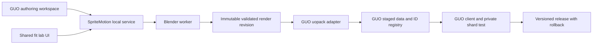

# SpriteMotion integration into GUO

Draft implementation plan, 2026-10-02. Based on SpriteMotion `eea8169` and the local GUO checkout at `8735dff`, plus the source files noted below. Claude is reworking the fit lab concurrently: this plan changes no fit-lab implementation and its API inventory must be reconciled after that work lands. Companion: [tooling research](related-tools-research.md).

Integrate SpriteMotion as GUO's content-authoring backend, with a GUO editor workspace for fitting, rendering, review and staged game testing. Keep one implementation of fit rules and final rendering. Let GUO own UO IDs, data staging, client previews and shard deployment. First prove that one new wearable travels through the entire pipeline; then bring the editing experience inside GUO.

## What is already available

| Area | Inspected evidence | Consequence |
|---|---|---|
| SpriteMotion fit lab | `tools/fit-lab/run.py`, its README, adjustment/build schemas | Local web UI, scoped corrections, revision-aware saves, backups and item builds already exist. Wrap these capabilities instead of copying fit logic into C#. |
| SpriteMotion builds | `tools/uo-content/studio.py`, `pipeline.py`, `rebuild.py` | Completed jobs and selective rebuilds provide a revision boundary. Final Blender frames are the import source; live preview screenshots are not. |
| GUO editor | `godot/GUO/addons/guo_editor/GuoEditorPlugin.cs`, `Panels/BulkPanel.cs`, ADR-0010 | Existing C# editor addon, tool subprocess UI, and assembly-reload lifecycle. Add authoring UI beside the existing tools and preserve its `#if TOOLS` boundary. |
| GUO data authoring | `tools/uopack/README.md`, ADR-0022 | PNG/JSON animation groups already feed staged MUL/UOP writers with read-back verification and ID ranges. Reuse this path. |
| Existing SpriteMotion bridge | `tools/uopack/outfit.py`, `run.py` | `from-outfit-lab` handles an older 2D atlas workflow, hardcodes selected wearables and skips backpack/familiar overlays. It is not an importer for current 3D studio jobs. Keep legacy behavior and add a general adapter. |
| Original-art overlays | ADR-0020 | Existing art/gump/hue overlays do not add equipment animation. New animations go through the staged-data route. |
| Private shard and world tooling | ADR-0012, ADR-0014, tools named in the editor wiki | Reuse private-shard setup and equip/world-object tests. The editor wiki says world objects are unstarted, but ADR-0014 records a verified slice; use detailed source/ADR evidence instead of that stale summary. |
| Asset Store | ADR-0019 | Current store kinds are not equipment-content distribution. Do not silently put UO animation payloads into a background/theme pack. |

GUO's documentation records successful staged-item and client checks for an earlier shield. Those are useful precedents, not fresh validation of SpriteMotion's current renderer. This research did not launch GUO, modify its repository or rerun its recorded tests.

## Recommended architecture

SpriteMotion owns source imports, model/action profiles, fitting, masks, build fingerprints and render artifacts. GUO owns equipment metadata, range allocation, classic file encoding/staging, game preview and shard integration. Imported assets keep stable logical IDs; GUO assigns numeric item, animation and gump IDs for the chosen shard. Saved fit keys must not change when a shard assigns a different numeric ID.

The worker remains an optional desktop tool. Exported Windows, Android, Deck and web game clients consume the finished assets without Python, Blender, licensed source meshes or editor code. GUO's existing classic presenter stays authoritative. Optional normal/depth lighting belongs to a later rendering proposal, not this integration.

## Fit lab inside the editor

There are two stages to the UI integration:

1. **Working bridge:** a SpriteMotion section in the GUO Assets dock opens the shared lab, submits/reconnects to jobs, imports successful revisions and launches the GUO review/test workflow. This initially opens the lab in a browser and must be labelled as such.
2. **Integrated workspace:** a SpriteMotion main-screen tab contains the lab and final-render review. First perform a Windows webview feasibility test for the existing web UI: WebGL support, keyboard focus, Ctrl+Z, local file selection, startup/shutdown and C# assembly reload. No webview dependency was found in the inspected GUO addon/project files; embedding is not assumed to work today. If that spike fails, build a native Godot fit UI against the same service. Do not maintain independent Python, JavaScript and C# fit-resolution rules.

Godot supports [main-screen editor plugins](https://docs.godotengine.org/en/stable/tutorials/plugins/editor/making_main_screen_plugins.html), and GUO already uses one for UO World. The exact API and any browser addon must be tested against GUO's pinned engine. Preserve the existing editor plugin's reload handling: reconnect by project/session/job identity after rebuild, and never start duplicate workers simply because the editor reconstructed a dock.

The final workspace should expose Assets, Fit, Animation, Render Review and Game Test. Fit retains per-item/group/slot/pack and per-action/direction corrections; independent animation, original/3D/off bases; undo/redo; immediate recovery cache; server autosave and three prior saves. Game Test uses decoded final frames through GUO, including layer ordering and hue behavior. A 3D GLB inspection viewport remains a separate view of the source geometry.

## Service and artifact contracts

Create schemas and a short ADR before implementing the bridge. Everything in this section is proposed.

**Service lifecycle.** Introduce a versioned adapter over the existing APIs, initially loopback-only. It reports its API version, supported operations, project identity, renderer/model hashes and dependency readiness. The current lab has `/api/state`, `/api/adjustments` and `/api/build`; the studio has its own build/job routes. These are not yet a unified stable integration API. Use one owner for worker scheduling so lab and studio builds cannot race over shared resources.

**Projects and jobs.** A request identifies the source item, immutable adjustment revision, requested blocks and model/render profile. Return a persistent job ID immediately. Proposed states are queued, running, cancelling, cancelled, failed and complete. Closing a dock detaches; cancellation is explicit. Reconnect after a crash and distinguish an interrupted worker from a completed job. Retrying the same request token must not enqueue duplicate work. A completed job records exactly the fit revision it used.

**Edits.** The service owns atomic saves and optimistic revisions. Preserve HTTP 409 conflicts and three backups. GUI undo changes the adjustment document; it does not silently undo an installed shard release. Keep editing history, immutable render revisions and deployed release history distinct. Native controls must not double-handle the lab's keyboard undo events. If undo across desktop/browser sessions is required, add a persisted edit journal; the current browser history alone cannot guarantee that.

**Transfer artifact.** A completed build export should include:

| Field family | Required information |
|---|---|
| Identity | Schema version, project ID, stable item ID, source job/revision, logical equipment slot and intended body profile |
| Reproducibility | Model and renderer fingerprints, input hashes, fit snapshot/hash, Blender/tool versions |
| Animation | Numeric action, stored direction, frame index/count, timeline sampling, explicit mirror map and coverage classification |
| Pixels | PNG paths/hashes, canvas, alpha convention, palette or quantization policy, crop rectangle and anchor/centres |
| Equipment | Item art, male/female paperdoll support declarations, tiledata/layer requirements; no invented placeholder completeness |
| Acceptance | Validation report, known failures, manual-review status and intended client/shard compatibility |
| Provenance | Source attribution and redistribution classification, separate for editable source and rendered output |

The schema, reader and a synthetic fixture are described in [transfer-artifact.md](transfer-artifact.md).

Use relative artifact paths and reject traversal or missing/hash-mismatched files. Local dependency paths belong in private configuration. Continue to use `SPRITEMOTION_SIDECAR`; GUO should not ingest or publish the sidecar.

**Pixel contract.** Preserve UO's 256×256 authoring canvas and anchor (128,192). For a crop with bounds `(left, top, right, bottom)`, the current GUO bridge uses `center_x = 128 - left`, `center_y = 192 - bottom`. Prove this with an asymmetric synthetic sprite, empty frames and negative centres. Preserve stored directions 0–4 and the explicit 5→3, 6→2, 7→1 mirror mapping. Do not inherit the legacy outfit atlas's facing-label convention accidentally. Quantize once per animation group's chosen palette; read back decoded pixels and centres. Keep playback timing separate from the Blender sampling interval.

## Milestones and acceptance

| Milestone | Implementation | Exit evidence |
|---|---|---|
| 0. Freeze the boundary | Reconcile Claude's revised lab; specify service, export manifest and GUO compatibility version. Record ADR status explicitly. | Shared procedural fixture accepted by both sides; no dependency on lab DOM structure. |
| 1. Import one real build | Add a generic SpriteMotion-job exporter and a GUO adapter alongside `from-outfit-lab`; use existing uopack/stage/ID machinery. | One wearable's full 35-action, five-stored-direction output decodes with matching pixels/anchors; all eight facings reviewed. Original install hashes unchanged. |
| 2. Prove it in the game | Complete item art, tiledata, intended paperdoll/body support and the ModernUO item definition. Launch the private stage and equip it. | Walk, attack, cast, die, mount and turn; capture GUO evidence. Verify layer/hue behavior and a control run without the new content. |
| 3. Connect the editor | Add service discovery, dependency doctor, item selection, Open Fit Lab, job progress/cancel, final review and import buttons. | Editor reload/crash reconnects; unsaved conflicts are visible; cancel leaves no promoted partial artifact. Closing the editor does not corrupt a build. |
| 4. Embed the fit workflow | Complete the webview spike and select embedded shared UI or native client. Add explicit geometry/live/final views. | Fit, Ctrl+Z, redo, save/recovery and build/review all work from the GUO workspace. Approximate masks never masquerade as final output. |
| 5. Broaden acceptance | Three representative items per supported slot; complete outfit tests; action/direction exceptions and selective rebuilds. | All required blocks present; no unexplained clipping/empty frames; unchanged blocks remain identical after a scoped correction. Body/sex limits stated. |
| 6. Release authoring tools | Clean setup, procedural CI fixtures, pinned dependencies, compatibility matrix and private-shard tutorial. | A second machine completes create → fit → render → import → equip → rollback without developer paths or bundled game data. |

Milestones 1–2 are the first useful deliverable. They should precede a large UI rewrite. Embedding the lab can follow after Claude's UI has settled and the import contract is stable.

## Reuse GUO game tooling

- **Assets and animation inspection:** extend the existing Assets/Bulk panels with item/job context; use GUO's loaders for final-frame checks rather than displaying a PNG as proof of runtime correctness.
- **World and shard editing:** hand selected content into the existing world-project and shard-object workflow. Distinguish a wearable item definition from placing a static decoration or spawning an NPC.
- **Data writing:** let `tools/uopack` and `tools/uodata_write` remain the integration's single staging path. Retain SpriteMotion's standalone VD/client export for users outside GUO.
- **ID management:** GUO's range policy owns numeric IDs and collisions. Never reuse an example shield's IDs for every item. Existing shard saves make item IDs durable; a rebuilt appearance must retain its allocation.
- **Testing:** extend GUO's editor smoke/reload, uopack fixture, data verify and private-shard equip checks. Run Python/JavaScript fit parity tests in SpriteMotion; add C# consumer contract tests in GUO.
- **Other tooling later:** add the Sprite Pose Editor, 2D outfit-lab round trips, pixel editing, motion import, props, creatures, tiles and VFX as separate supported profiles. Equipment assumptions such as 35 actions and five stored directions must not silently become universal game-asset rules.

## Deployment and recovery

Stage a new immutable content version and verify it before activation. Activation selects the matching client data override and private-shard data directory together; preserve the prior version and its allocation registry. Assume client/shard restart or reconnect for animation data initially. GUO's live map-edit transport does not prove animation-cache hot reload exists.

Rollback restores the previous client/shard content version and preserves saved-world identity. Never remove an allocated item ID still referenced by a shard save. Serialize writes to a stage or use one temporary stage per release; one failed item must not leave a partially active outfit. Desktop publication and remote distribution are separate operations from autosaving a fit.

## Public distribution

Keep SpriteMotion independently usable and versioned. GUO should reference a pinned compatible release or configured local checkout, with an updateable compatibility manifest; avoid copying the entire source into GUO. Publish code, schemas, documentation and procedural fixtures. Local UO data, canonical scenes and commercial source packs stay outside both public repositories.

An equipment distribution system is a later GUO Asset Store contract extension. Specify permitted payloads, attribution, hashes, dependency/base-install compatibility, ID allocation, installation and rollback before enabling it. Full staged MUL/UOP files can contain copied proprietary base content, so they are not public upload artifacts. A distributable delta must contain only content whose redistribution is allowed and be applied locally to the user's installation. No automatic upload follows a successful render.

## Proposed implementation locations

| Repository | Proposed change |
|---|---|
| SpriteMotion | New bridge/export schemas under `common/schemas/`; service adapter and export helper under a dedicated `tools/` job directory; reuse `tools/uo-content` builds and `tools/fit-lab` adjustments. |
| GUO | New SpriteMotion client/panel code under `godot/GUO/addons/guo_editor/`; generic importer alongside `tools/uopack/outfit.py`; orchestration under `tools/guo` or a dedicated tool following GUO conventions. |
| Both | Synthetic contract fixtures, compatibility tests and a recorded end-to-end acceptance recipe. |

These are proposed locations, not files implemented by this plan. No runtime refactor, GUO change, third-party installation, public push or message to another developer was performed for this research.
