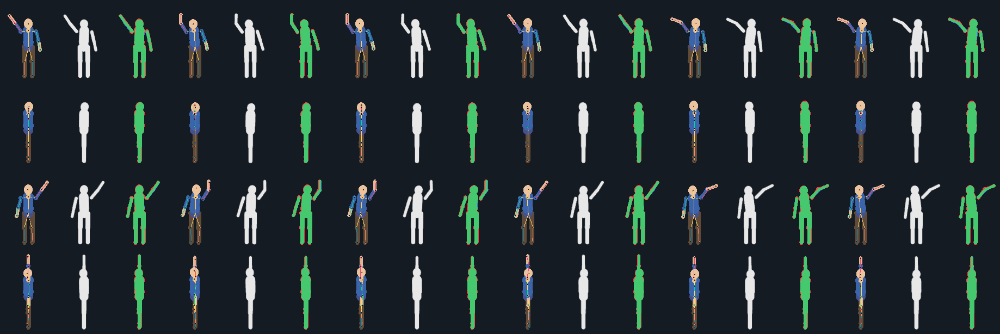

# Reconstruction workflow

The goal is a 3D character whose animations, rendered through the game's
camera, land on the original sprites. With that in place, new frames, outfits
and equipment can be made in 3D and rendered back out as sprites that match
the original art.

```text
 extract ──► annotate ──► fit ──► key in Blender ──► render views ──► compare
   ▲             ▲                                                    │
   │             └──────────── correct the worst frames ◄─────────────┘
 your game files
```

Each step is a command. The Windows launcher that runs it is given in
brackets.

## 0. Inputs you supply

- **The game files**, read by the game's adapter. They never leave your machine.
- **A rigged model** in a `.blend`, kept in `workspace/`. Any humanoid works
  if you write a rig mapping for it (step 3). The repository ships no models.

## 1. Extract [`pipeline\1-extract-uo.bat`]

```sh
python -m spritemotion extract --game ultima-online --character body-400 \
    --source <game folder> --out workspace/ultima-online/body-400
```

This writes `dataset.json`, `skeleton.json`, one canvas-sized PNG per frame
under `frames/`, and the bundled annotations. Only the annotations that match
your frames are applied (see [annotation-format.md](annotation-format.md)).
Check the result with `spritemotion status <dataset>`
[`pipeline\2-status.bat`].

## 2. Annotate [`editor\sprite-pose-editor.bat`]

Open the dataset in the [Sprite Pose Editor](../tools/sprite-pose-editor/README.md)
and correct the poses you are going to fit. Only approve a pose after checking
every joint.

Where you should spend effort: the fit can only be as good as its independent
targets. One approved view per frame constrains the pose, but not its depth.
Approving two or more directions of the same frame (for example SE and one
profile) makes the depth solvable.

Estimates can be filled in automatically:

```sh
python -m spritemotion estimate-mirror <dataset> --sequences action-000
python -m spritemotion estimate-rig <dataset> --sequence action-000 --rig rig.json \
    --mapping mapping.json --poses current-action.json [--renders renders/]
```

Rig projections (`estimate-rig`) put the joints roughly in the right place,
which makes correcting them faster. They are always labelled
`independent: false`.

## 3. Export the rig and write a mapping

```sh
blender -b --factory-startup model.blend --python tools/blender/export_rig.py -- \
    --out workspace/fits/rig.json [--armature Armature]
```

`rig.json` (`spritemotion.rig`) holds the armature's world matrix and, per
bone, its parent, rest matrix (`matrix_local`) and length. SpriteMotion's
numpy forward kinematics matches Blender to about 1e-7.

A **rig mapping** (`spritemotion.rig-mapping`) connects skeleton joints to
bones:

```json
{
  "schema": "spritemotion.rig-mapping", "schema_version": 1,
  "skeleton": "humanoid-20", "rig": "rigify",
  "sides": {"A": "L", "B": "R"},
  "joints": {
    "head":  {"bone": "head", "at": 0.5},
    "pelvis": {"mix": [{"bone": "thigh_fk.L", "at": 0, "w": 0.5}, {"bone": "thigh_fk.R", "at": 0, "w": 0.5}]},
    "arm_{chain}_elbow": {"bone": "forearm_fk.{side}", "at": 0}
  },
  "fit": {
    "root_bone": "torso",
    "bones": ["torso", "upper_arm_fk.{side}", "forearm_fk.{side}"],
    "limits_deg": {"default": 150, "torso": 100}
  }
}
```

In this mapping:

- `at` is the position along the bone: 0 is the head, 1 is the tail.
- `{chain}` and `{side}` expand through `sides`.
- `fit.bones` lists the bones the solver may rotate. `root_bone` may also
  translate.
- `limits_deg` caps how far each bone may rotate from its seed.

Mappings for Rigify (FK controls) and Mixamo rigs ship in
`games/ultima-online/skeletons/rig-mappings/`.

## 4. Fit [`pipeline\3-fit.bat`]

```sh
python -m spritemotion fit <dataset> --sequence action-022 --rig rig.json \
    --mapping mapping.json --out workspace/fits/action-022.json \
    [--targets approved|independent|all] [--seed current.json] [--camera camera.json]
```

The solver works one frame at a time. It rotates the fitted bones so that the
mapped joints, turned to each view's facing and projected through the
dataset's camera, land on the annotated points. Terms that pull against that:

- a prior toward the seed pose
- a temporal term toward the previous frame
- limits on how far the root may move
- an optional floor term

`--settings` takes a JSON file of these weights (`prior_weight`,
`temporal_weight`, `root_weight`, `floor_weight`, `floor_joints`,
`root_limit`, `max_iterations`).

| `--targets` | Uses |
|---|---|
| `approved` (default) | approved poses only |
| `independent` | approved poses and independent estimates (manual, estimator, mirrors of those) |
| `all` | everything, but dependent (rig-projection) poses only with `--allow-dependent-targets` |

The output is a **pose solution** (`spritemotion.pose-solution`) holding the
following:

- the camera it used
- `target_selection`: the poses used, and the poses skipped as unapproved,
  dependent, or fingerprint-mismatched
- the solver settings
- per frame, each bone's `rotation_quaternion`, plus `location` for the root
- a report of pixel error per view and per joint

### Mirrored views

Some games store only some facings and draw the others by flipping them (UO
draws N, NE and E by flipping W, SW and S). A flipped view is **not** another
camera angle on the same 3D pose: on screen it is the mirror-image character.
Directions marked `stored: false` with a `mirror_of` partner are handled the
way the game draws them:

- **fit:** a pose annotated on a mirrored view is flipped back
  (x → 2·`mirror_axis_x` − x) and used as a target for the partner view. If
  the partner has a usable pose of its own, that pose wins. The report lists
  both cases (`mirrored_into_partner`, `skipped_mirrored_view`).
- **reprojection check, rig projection:** the partner view is projected, then
  flipped.
- **render, compare, sheet:** only stored views are rendered. A mirrored view
  is compared against its partner's render, flipped.

Treating a flipped view as a camera angle makes an asymmetric action (one arm
raised, a weapon in one hand) pull the fit toward a pose that is half the
character and half its mirror image.

To seed a fit from an existing animation, export that animation first:

```sh
blender -b --factory-startup model.blend --python tools/blender/export_action.py -- \
    --out current.json --action Walk --frames 10 --frame-start 1 --frame-step 4 --mapping mapping.json
```

### Camera

The camera is an **affine orthographic** projection:
canvas = anchor + M · [x, y, z], with M a 2×3 matrix in pixels per world
unit (x east, y north, z up). Each direction is modelled as the character
turned about z at the origin until its rest forward (`--model-forward`,
default `0,-1`) points along the direction's `facing`.

Camera candidates are plain JSON files (see
`games/ultima-online/profiles/cameras/`). Passing `--camera` to `fit`,
`estimate-rig`, `apply_solution.py` or `render_views.py` tests a candidate
without editing the dataset.

## 5. Key in Blender [`pipeline\4-key-in-blender.bat`]

```sh
blender -b --factory-startup model.blend --python tools/blender/apply_solution.py -- \
    --solution workspace/fits/action-022.json --action fit_action-022 --mapping mapping.json \
    --dataset <dataset> --frame-start 1 --frame-step 4 \
    --report workspace/fits/action-022.apply-report.json --save model.blend --note "approved SE targets"
```

This keys each frame into a new action at Blender frame
start + frame × step. It handles quaternion, axis-angle and Euler bones. It
then reads the pose back out of Blender, which gives two checks:

- `max_fk_delta`: Blender versus the solver's FK. It should be about 1e-6.
- `mean_px` / `max_px`: the joints Blender actually posed, projected and
  compared with the effective annotations.

Nothing is overwritten. If the action already exists, the old one is kept in
the file as `fit_action-022.v001` and so on. Saving over `model.blend` first
copies the previous file to `model.versions/`, and records the new version
with its reprojection error and note:

```sh
python -m spritemotion versions list model.blend
python -m spritemotion versions restore model.blend --version 3
```

The launcher is `pipeline\versions.bat`. See
[tools/blender/README.md](../tools/blender/README.md#scene-versions).

## 6. Render every view [`pipeline\5-render-views.bat`]

```sh
blender -b --factory-startup model.blend --python tools/blender/render_views.py -- \
    --dataset <dataset> --sequence action-022 --action fit_action-022 --out workspace/renders \
    --frame-start 1 --frame-step 4
```

The dataset camera becomes a Blender orthographic camera with the same
pixel mapping (`spritemotion.rendering.blender_camera_params`):

- the camera axes come from the rows of M
- `ortho_scale` = width / |M row 0|
- the pixel aspect handles unequal row lengths
- pixel *i* has its centre at x = *i*, as in the sprites

The model is turned for each direction and rendered as a flat, unfiltered
silhouette at the canvas size, into `renders/<sequence>/d<direction>_f<frame>.png`.
Only stored directions are rendered (see [mirrored views](#mirrored-views)).
Pass `--keep-render-settings` to keep your own look.

## 7. Compare [`pipeline\6-compare.bat`]

```sh
python -m spritemotion compare <dataset> --renders workspace/renders --sequences action-022 --out compare.json
python -m spritemotion sheet <dataset> --sequence action-022 --renders workspace/renders --out sheet.png
```

Add `--attach model.blend --label fit_action-022` to `compare` to store the
scores on the scene's current version, so `versions list` shows which pass
matched the sprites best.

`compare` computes the silhouette IoU per frame, and its mean per direction
and per sequence. `sheet` lays out sprite + joints, render, and difference
for every frame:



**IoU is shape overlap, not completion.** A high score can hide swapped
limbs or wrong depth, and single-view fits can improve one direction while
making the others worse. Use the sheet to find frames that are worst, correct
their annotations (step 2), and fit again.

## Verified on the sample

`launchers\dev\sample-loop.bat` and `tests/integration/test_blender_loop.py`
run every step above on the procedural sample. Results:

- the fit recovers the true 3D joints to within 0.02 units
- Blender reproduces the solver's pose to about 1e-7
- the keyed reprojection error averages under 1 px
- silhouettes overlap at about 0.9 IoU (the capsule model is only an
  approximation of the drawn figure)

## Beyond pose: outfits and equipment

After the body animations match, clothing and equipment are modelled on the
3D character and rendered with the same camera, canvas and timeline. Because
they share the camera and anchor, the renders stack onto the original sprites
the way the game layers its own paper-doll art. Game recipes (for example
`games/ultima-online/recipes/`) describe that game's layer order and export
conventions.
