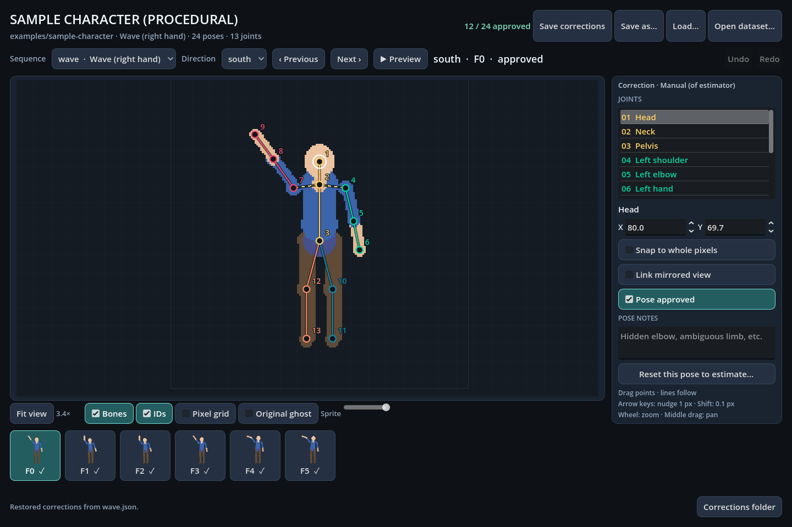

# Sample character

A small, redistributable character for trying and testing every step of
SpriteMotion without any game. Everything here is generated by
`make_sample.py` from code, with no external art. It is covered by the
repository's MIT license.



| | |
|---|---|
| Canvas | 160×192, ground anchor (80, 170), mirror axis x = 79.5 |
| Directions | south, east, north, west, all stored (no mirrored views) |
| Camera | affine orthographic `[[70, 0, 0], [0, −35, −60.62]]`: 70 px per unit, looking north, 30° down |
| Skeleton | `stick-13`: 13 joints with anatomical left/right names |
| Rig | `rig/sample-rig.json`: 12 bones |
| Sequences | `wave` (right hand) and `walk`, 6 frames each |

The figure is made of capsules drawn with a pixel-art outline. Because it is
generated, its **true 3D poses are known** (`truth/*.pose-solution.json`),
so a fit can be scored in 3D, not only by reprojection.

## Annotations

- `annotations/estimates/`: the true joints plus about 1 px of noise,
  labelled `method: estimator`, `independent: true`. This simulates an
  image-based estimator.
- `annotations/corrections/wave.json`: the south and east views of `wave`,
  exact and **approved**. These simulate a person's review.

So `fit --targets approved` uses 2 views per frame, and
`--targets independent` uses all 4.

## Files

| Path | |
|---|---|
| `make_sample.py` | generator. It is deterministic, and `tests/integration/test_sample_character.py` checks it reproduces the committed files. |
| `build_blend.py` | Blender script: builds `sample.blend` with an armature from `rig/sample-rig.json` and capsule meshes of the same radii |
| `dataset.json`, `skeleton.json`, `frames/` | the dataset |
| `rig/sample-rig.json`, `rig/sample-mapping.json` | rig and rig mapping |
| `truth/` | ground-truth pose solutions |

## Use

```bat
launchers\editor\sample-character.bat
launchers\dev\sample-loop.bat         :: build .blend -> fit -> key -> render -> compare (output in workspace\sample)
launchers\dev\regenerate-sample.bat   :: rewrite this folder from make_sample.py
```

Expected: fit error below 0.02 units against the truth, keyed reprojection
error below 1 px, and silhouette IoU about 0.9. The capsule model is not a
perfect match for the drawn outline.
