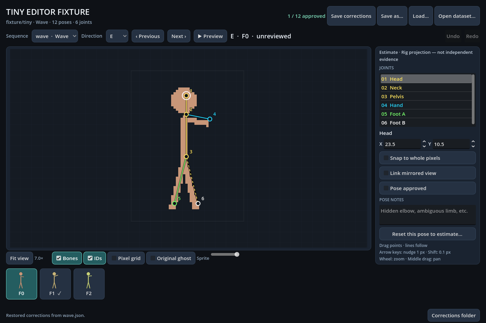

# Sprite Pose Editor

A Godot 4.7 editor for reviewing and correcting 2D joint annotations on sprite
frames. It works with any SpriteMotion dataset. The canvas size, directions and
mirror pairs, sequences, frame counts, skeleton and colours all come from the
dataset manifest (`dataset.json`, see `common/schemas/sprite-sequence.schema.json`).
Nothing is hard-coded for a particular game.



## Launch

On Windows, use `launchers\editor\sprite-pose-editor.bat [dataset]`, or
`launchers\editor\sample-character.bat` for the bundled sample. Godot is
found as described in [tools/godot/README.md](../godot/README.md).

You can also open this folder as a Godot 4.7 project, or run it directly
with an absolute dataset path:

```bat
tools\godot\Godot_v4.7-stable_win64.exe --path tools\sprite-pose-editor -- --dataset=<absolute path to dataset.json or its folder>
```

The editor picks a dataset from these sources, in order:

1. `--dataset=<dataset.json or its folder>` (a user argument, after `--`)
2. the `SPRITEMOTION_DATASET` environment variable
3. the last dataset you opened (stored in Godot's `user://settings.cfg`)
4. otherwise it shows a welcome screen with an **Open dataset…** button

**Open dataset…** in the header switches datasets. Unsaved work is preserved
first.

To save a screenshot of the loaded UI and exit, pass `--capture=<png path>`.

## Controls

| Action | Input |
|---|---|
| Move a joint | Drag it; connected lines follow. Linked mirror edits are undone together. |
| Nudge the selected joint | Arrow keys: 1 px. Shift+Arrow: 0.1 px |
| Set exact coordinates | X / Y fields in the inspector |
| Zoom / pan / fit | Mouse wheel zooms around the cursor. Middle-drag pans. **F** fits the view. |
| Frames | **A**/**D** or Page Up/Down, or click the frame strip (it scrolls for long sequences) |
| Preview playback | **Space** (uses the sequence's `frame_duration_ms` if set) |
| Undo / redo | Ctrl+Z / Ctrl+Y or Ctrl+Shift+Z |
| Save | Ctrl+S. **Save as…** exports a copy. **Load…** imports a correction file for the selected sequence. |

View toggles: bones, joint IDs, pixel grid, **Original ghost** (the estimate
drawn under your edits), sprite opacity, and snap to whole pixels.
**Link mirrored view** also updates the direction's `mirror_of` partner using
`x' = 2·mirror_axis_x − x`.

Moving a joint clears the pose's approval (review status becomes
`in_progress`). Tick **Pose approved** only after checking every joint. Notes
are stored per pose. **Reset this pose to estimate…** restores the estimate
(or the default layout), and you can undo it.

## Annotation layers

Annotation paths are set by the manifest's `annotations` block (the defaults
are shown):

```text
<dataset>/annotations/estimates/<sequence>.json         estimate layer: read-only, never written
<dataset>/annotations/corrections/<sequence>.json       correction layer: written by Save / Ctrl+S
<dataset>/annotations/corrections/<sequence>.autosave.json   autosave, 0.8 s after the last edit
```

- **Effective pose** = the correction if there is one, otherwise the estimate.
  A frame with neither starts from a default layout: joints spaced along the
  sprite's vertical centre line.
- **What gets saved:** only poses where you moved joints (compared with the
  estimate or default layout), set a review status other than `unreviewed`,
  or wrote notes. Untouched estimates are never copied into the correction
  layer.
- Each saved pose carries its `frame_id`, the manifest frame's
  `source_fingerprint`, a `review` block, and `provenance`:
  - `method: "manual"`
  - `source_method`: the method of the estimate it started from
  - `independent`: `true` only if the pose is approved or its estimate was
    already independent evidence
- **Crash safety:** writes go to `.tmp` and are then renamed; the previous file
  is kept as `.bak`. On open, the newer of the saved file and the autosave is
  restored. If either file is unreadable, it is left untouched, autosave
  pauses, and you are asked to use **Save as…**. Work is saved before switching
  sequences, opening another dataset, or closing the window.
- Saving into the estimates folder is refused.

## Provenance and fingerprint warnings

The inspector shows where the current pose came from, for example:

- "Estimate · Rig projection — not independent evidence"
- "Correction · Manual (of rig projection)"
- "Estimate · Mirrored from W"

Rig projections are starting points only. Don't use them as evidence that a
fit of the same rig is accurate.

If a pose's `source_fingerprint` doesn't match the extracted frame's
`fingerprint`, a red banner appears above the canvas. It means the annotation
was drawn for different pixels, such as art from another client version.
Review every joint before approving.

## Tests

```bat
cd tools\sprite-pose-editor
Godot_v4.7-stable_win64_console.exe --headless --path . --editor --import --quit
Godot_v4.7-stable_win64_console.exe --headless --path . --script res://tests/test_editor.gd -- --dataset=tests/fixtures/tiny
```

The suite copies the fixture to `tests/output/work/`, so the real save paths
run without touching committed files. It writes
`tests/output/test-report.json` and exits non-zero on failure. It covers:

- loading and validating the manifest and skeleton
- merging the estimate and correction layers
- edits, approval invalidation and linked mirrors
- undo/redo and reset
- a save roundtrip that writes only meaningful poses, with `.bak` rotation
- rejection of malformed or out-of-range input
- the protected estimates folder
- sequence switching with save, and the unreadable-autosave path
- loading every sprite
- real GUI drag and keyboard nudge through the canvas
- snapping and playback

`tests/make_fixture.py` regenerates `tests/fixtures/tiny/`. The fixture is a
procedurally drawn stick figure, our own and redistributable, on a 48×64
canvas. It has 4 directions (two mirror pairs), 2 sequences, a 6-joint
skeleton, a partial estimate layer and one approved correction.
